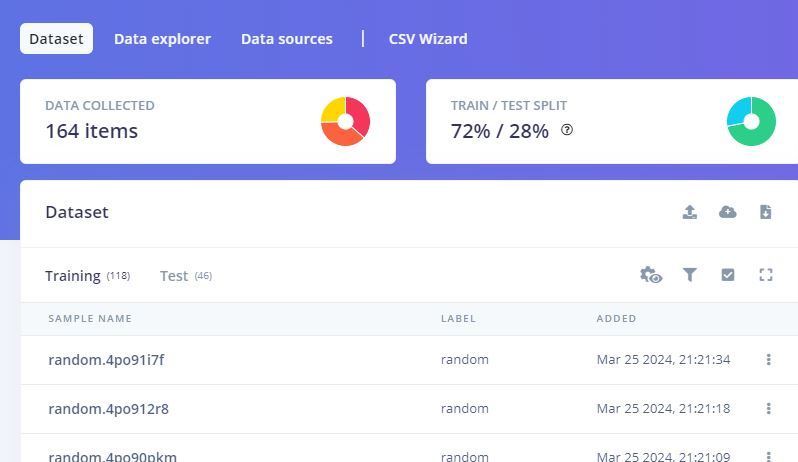
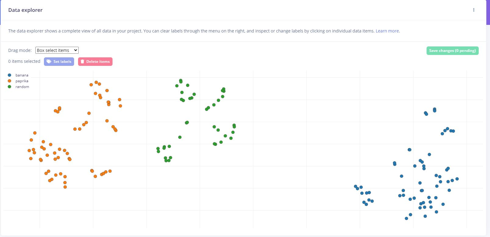
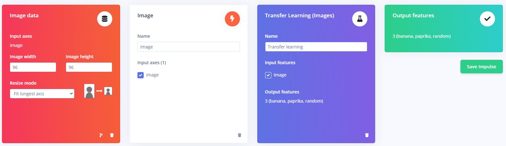
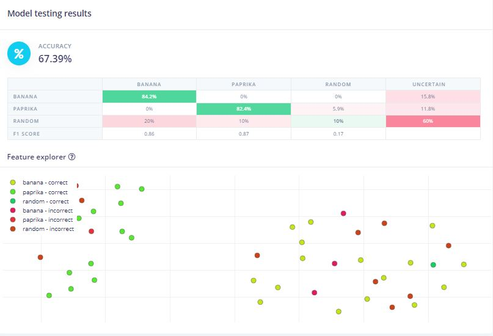
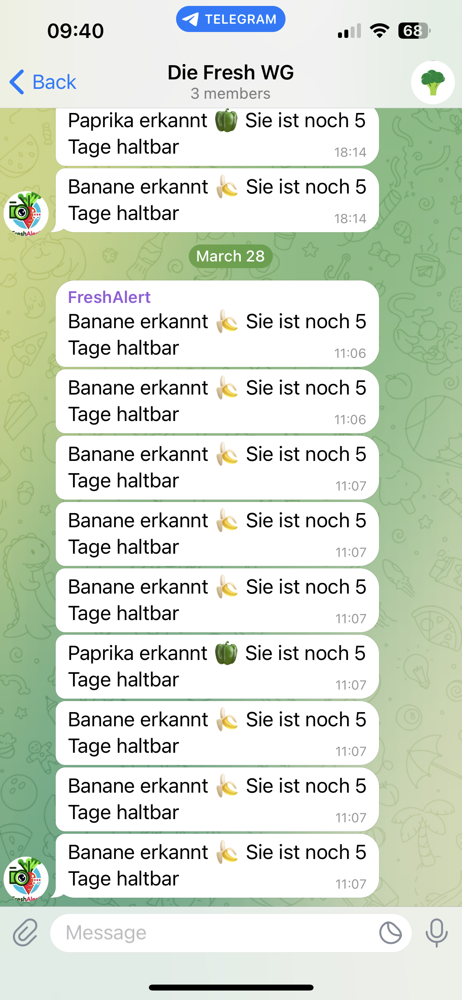

# FreshAlert - TinyML-basierte Gemüseklassifizierung
<p align="center">
  
</p>


## Überblick
Kurze Beschreibung des Projekts und seiner Hauptfunktionen. Erläutern Sie den Zweck von FreshAlert und wie es mit einem Arduino Microcontroller arbeitet, um Gemüse zu scannen, zu klassifizieren und die Haltbarkeit des Gemüses über eine Telegram-Nachricht mitzuteilen.

## Inhaltsverzeichnis
- [Überblick](#überblick)
- [Technologien](#technologien)
- [Hardwareanforderungen](#hardwareanforderungen)
- [Softwareanforderungen](#softwareanforderungen)
- [Einrichtung und Installation](#einrichtung-und-installation)
  - [Modelltraining mit Edge Impulse](#modelltraining-mit-edge-impulse)
  - [Modelltesting mit Edge Impulse](#modelltesting-mit-edge-impulse)
  - [Modelldeployment via Arduino IDE](#modelldeployment-via-arduino-ide)
- [Python-Script für Telegram-Nachrichten](#python-script-für-telegram-nachrichten)
- [Verbindung und Datenübertragung](#verbindung-und-datenübertragung)


## Technologien
- Arduino BLE 33 Sense
- Edge Impulse
- Arduino IDE
- Python
- Telegram BotFather
- Telegram API

## Hardwareanforderungen
- Arduino BLE 33 Sense
- Kameramodul (OV7675)
- USB-Kabel 
- Laptop (dient als Server) #notwending?


## Softwareanforderungen
- Edge Impulse Web Interface
- Arduino IDE
- Telegram
- Python
- Imports:
  
    ```python
  import serial
  import requests
  import time
    ```
  


## Einrichtung und Installation
Den Arduino entsprechend des Betriebssystems instalieren - siehe [Anleitung](https://www.arduino.cc/en/software).
Anschließend einen Account bei [EdgeImpulse](https://edgeimpulse.com/) anlegen und den Arduino als Device registrieren. 

### Modelltraining mit Edge Impulse
Um das Modell den Anforderungen entsprechend zu trainieren, wurden mit Hilfe des Kameramoduls insgesamt 164 Bilder aufgenommen.
118 Bilder werden zu Training - 46 zur Validierung des Modells verwendet.

Die Trainingsdaten sind entsprechend gelabelt:

| Label    | # Bilder|
|----------|----------|
| Banane   | 43  |
| Paprika  | 45  |
| Random   | 30  |


#### Dataset:




#### Ansicht Data Explorer in EdgeImpulse:



Anschließend wird ein Impulse erstellt.
" Ein Impuls nimmt Rohdaten auf, nutzt die Signalverarbeitung, um Merkmale zu extrahieren, und verwendet dann einen Lernblock, um neue Daten zu klassifizieren."(EdgeImpulse)

96x96: Dies bezieht sich auf die Dimension der Eingabebilder, die das Netzwerk erwartet. In diesem Fall sind die Eingabebilder 96x96 Pixel groß





Training des Modells mit folgenden Parametern:


Accuracy des Modells beträgt 83.3 % - Loss: 0.46 mit entsprechender On-Devices performance (Estimate for Arduino Nano 33 BLE Sense)


### Modelltesting mit Edge Impulse


Modell testing Ergebnis:




Abschließend das Modell als Arduino Libary herunterladen um das Modell mit Hilfe der ArduinoIDE auf der Hardware zu deployen.


### Modelldeployment via Arduino IDE
Anleitung, wie das Modell auf den Arduino Microcontroller über die Arduino IDE deployt wurde.

Das als heruntergeladene Modell kann mit Hilfe der ArduinoIDE in Form eines Sketch angepasst und anschließend auf die Hardware deployed werden.

Um das Kameramodul zu nutzen muss die entsprechende Bibliothek eingebunden werden


```cpp
#define EI_CAMERA_RAW_FRAME_BUFFER_COLS
```
Um das Label mit dem höchstem Wert aus der Reihe der Klassifizierungsergebnisse zu ermitteln und nur diesen auszugeben, wurde folgender Codeblock entwickelt
und eingebunden:

```cpp
         
        size_t max_index = 0;
        float max_value = result.classification[0].value;

        // Durchlaufe alle Labels, um den höchsten Wert zu finden und alle anderen Werte zu speichern
    for (size_t ix = 0; ix < EI_CLASSIFIER_LABEL_COUNT; ix++) {
        // Speichere das Label und den Wert, wenn der Wert größer oder gleich dem bisherigen maximalen Wert ist
        if (result.classification[ix].value >= max_value) {
            max_index = ix;
            max_value = result.classification[ix].value;
      }

      // Drucke das aktuelle Label und den Wert
      ei_printf("Label: %s, Value: %.5f\n", result.classification[ix].label, result.classification[ix].value);
    }

  // Drucke das Label mit dem höchsten Wert
  ei_printf("Highest Value Label: %s, Value: %.5f\n", result.classification[max_index].label, result.classification[max_index].value);

```

Um die Klassifizierung des Modells im Prototypen zu veranschaulichen, werden alle Labels mit dem jeweiligen Value ausgegeben.
In zukünftigen Versionen soll nur das Label mit dem höchsten Klassifizierungsergebnis ausgegeben werden - diese Anpassung kann durch das Löschen der Zeile

```cpp
 ei_printf("Label: %s, Value: %.5f\n", result.classification[ix].label, result.classification[ix].value);
```
schnell erreicht werden.

## Python-Script für Telegram-Nachrichten
### Projektbeschreibung: Telegram-basierte Erinnerung für Haltbarkeit von Obst und Gemüse

#### Ziel:
Das Ziel des Projekts besteht darin, den Nutzern eines Mikrocontrollers eine Erinnerung zur Haltbarkeit von Obst und Gemüse zu bieten. Hierfür wird die Übermittlung von Haltbarkeitsinformationen über die Telegram-Plattform realisiert.

#### Umsetzung:
1. **Einrichtung des Telegram-Bots:**
   - Ein Telegram-Bot wird mithilfe von "BotFather" erstellt.
   - Der Bot wird einer gemeinsamen Telegram-Gruppe hinzugefügt, an der alle beteiligten Nutzer teilnehmen.
   - Mithilfe von "IDBot" wird die Gruppen-ID exportiert und zusammen mit dem Bottoken des Bots in das Skript integriert.

2. **Serielle Verbindung mit dem Mikrocontroller:**

    ```python
    ser = serial.Serial('COM6', 115200, timeout=1)
    time.sleep(2) 
    ```
   
   - Eine serielle Verbindung mit dem Mikrocontroller wird hergestellt und konfiguriert.
   - Verwendete Funktion: `serial.Serial()`
     - `COM6`: Port, an den das Gerät angeschlossen ist.
     - `115200`: Baudrate für die serielle Kommunikation.
     - `timeout=1`: Zeitlimit für das Lesen von Daten.

    
      

4. **Funktion zur Nachrichtenübermittlung an Telegram:**

    ```python
    def send_to_telegram(message):
    bot_token = 'PLACEHOLDER'
    bot_chatID = 'PLACEHOLDER'
    send_text = f'https://api.telegram.org/bot{bot_token}/sendMessage?chat_id={bot_chatID}&parse_mode=Markdown&text={message}'

    response = requests.get(send_text)
    return response.json()
    ```
   
   - Die Funktion `send_to_telegram(message)` wird erstellt, um Nachrichten an den Telegram-Bot zu senden.
   - Die Funktion akzeptiert eine Nachricht als Argument.
   - Platzhalter für den Bot-Token und die Chat-ID werden innerhalb der Funktion verwendet.
   - Eine HTTPS-Anfrage-URL wird zusammengesetzt, um die Nachricht über die Telegram-API zu senden.
   - Die Funktion gibt die Antwort der Telegram-API als JSON zurück.
  
6. **Erkennung und Benachrichtigung:**

     ```python
     while True:
      if ser.in_waiting > 0:
         text = ""
         line = ser.readline().decode('utf-8').rstrip()        
          print("Vom Arduino erhalten:", line )
          if "Highest Value Label: banana" in line:
            text = "Banane erkannt 🍌 Sie ist noch 5 Tage haltbar"
            print(" 'banana' wurde erkannt"+ "\n")
            send_to_telegram(text)
          elif "Highest Value Label: paprika" in line:
            text = "Paprika erkannt 🫑 Sie ist noch 5 Tage haltbar"
            print("'paprika' wurde erkannt"+ "\n")
            send_to_telegram(text)
          elif "Highest Value Label: random" in line:
            text = "Kein Produkt erkannt 🤷‍♂️"
            print("'random' wurde erkannt - keine Nachricht an Telegram gesendet"+ "\n")          
     ```
     
   - In einer Endlosschleife wird kontinuierlich der serielle Port auf eingehende Daten überwacht.
   - Bei vorhandenen Daten wird eine Zeile aus dem seriellen Port gelesen, dekodiert und überflüssige Leerzeichen oder Zeilenumbrüche entfernt.
   - Wenn bestimmte Schlüsselwörter in der empfangenen Nachricht erkannt werden, wird eine entsprechende Benachrichtigung mit Haltbarkeitsangabe erstellt und an Telegram gesendet.
   - Erkannte Frucht- oder Gemüsesorten werden in der Konsole bestätigt, und bei Bedarf wird eine Nachricht an Telegram gesendet.

 

#### Hinweise:
- Der Code wartet derzeit auf die Klassifizierung des Mikrocontrollers und sendet basierend auf dem Ergebnis Nachrichten an den Telegram-Bot.
- Es wurden keine genauen Berechnungen zur Haltbarkeit einzelner Obst- oder Gemüsesorten durchgeführt, da es sich um die Entwicklung eines Prototypen handelt.
- Die Platzhalter für den Bot-Token und die Chat-ID müssen durch die entsprechenden Werte ersetzt werden.
- Die genannten Code-Snippets wurden ausgelassen, um Fehler zu vermeiden.


## Verbindung und Datenübertragung

Um die Daten des Arduinos in einer Telegram-Nachricht zu verarbeiten, wurde eine USB-Verbindung hergestellt.

1. **Arduino anschließen:**
   - Stecken Sie den Arduino mithilfe des USB-Kabels an einen freien USB-Anschluss Ihres Windows-PCs an.

2. **Treiberinstallation (falls erforderlich):**
   - In den meisten Fällen erkennt Windows automatisch den Arduino und installiert die erforderlichen Treiber.
   - Wenn der Treiber nicht automatisch installiert wird oder Probleme auftreten, können Sie den Arduino-Treiber manuell installieren. Laden Sie den Treiber von der offiziellen Arduino-Website herunter und installieren Sie ihn.

3. **Ermitteln des COM-Ports:**
   - Öffnen Sie die Systemsteuerung auf Ihrem Windows-PC.
   - Navigieren Sie zu "Geräte-Manager".
   - Unter "Anschlüsse (COM & LPT)" finden Sie Ihren Arduino. Der COM-Port, der dem Arduino zugewiesen ist, wird angezeigt (z. B. COM3, COM4 usw.).
   - Der COM-Port kann außerdem in der Arduino-IDE ermittelt werden

4. **Serialerkennung im Code:**
   - Im Programm (z. B. Python-Skript) verwenden Sie die ermittelte COM-Port-Nummer, um die serielle Verbindung herzustellen.
   - Stellen Sie sicher, dass die Baudrate und andere Parameter korrekt konfiguriert sind, je nach den Einstellungen Ihres Arduino-Skripts.

5. **Datenübertragung testen:**
   - Sobald die Verbindung hergestellt ist, können Sie die Datenübertragung zwischen dem Arduino und dem PC testen.
   - Lesen Sie die Daten von der seriellen Verbindung und überprüfen Sie, ob Sie Daten vom Arduino erhalten, um sicherzustellen, dass die Verbindung ordnungsgemäß funktioniert.





